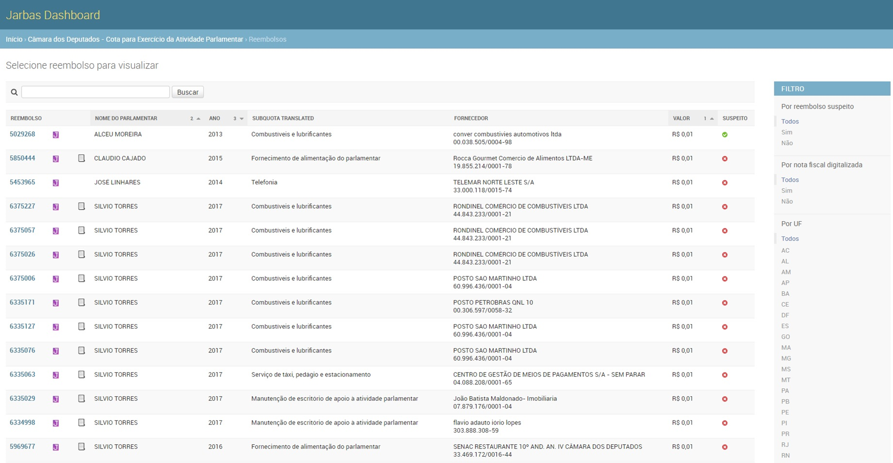
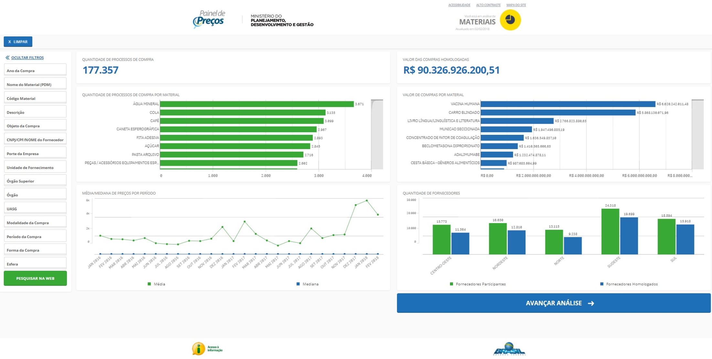

# O PROJETO DE INICIAÇÃO CIENTÍFICA
Pesquisa sobre visualização de dados para Dashboards.

# METODOLOGIA CIENTÍFICA

# FERRAMENTA DE AVALIAÇÃO

A ferramenta atualmente está em formato de questionário,
com dezenove perguntas, separadas em quatro áreas: 

1) Gráficos; 

2) Cor; 

3) Legibilidade e texto; 

4) Organização e atenção.

Escala a ser seguida ao responder:

1 - Não atende;

2 - Atende raramente;

3 - Atende ocasionalmente;

4 - Atende frequentemente;

5 - Atende plenamente.

<html>
  <head>
	  <meta http-equiv="Content-Type" content="text/html; charset=utf-8">
	  <meta name="company" content="Microsoft Corporation" />
	
  </head>

  <body>

	<table border="0" cellpadding="0" cellspacing="0" id="sheet0" class="sheet0 gridlines">
		<col class="col0">
		<col class="col1">
		<col class="col2">
		<col class="col3">
		<col class="col4">
		<col class="col5">
		<col class="col6">
		<col class="col7">
		<col class="col8">
		<col class="col9">
		<col class="col10">
		<col class="col11">
		<col class="col12">
		<col class="col13">
		<col class="col14">
		<col class="col15">
		<col class="col16">
		<col class="col17">
		<col class="col18">
		<col class="col19">
		<col class="col20">
		<col class="col21">
		<col class="col22">
		<col class="col23">
		<col class="col24">
		<col class="col25">
		<col class="col26">
		<tbody>
		  <tr class="row0">
			<td class="column0 style1 s">Nº</td>
			<td class="column1 style25 s">Questão</td>
			<td class="column2 style26 s">Detalhamento</td>
			<td class="column3 style2 s">Nota (1-5)</td>
			<td class="column4 style24 s">Referências</td>

		  </tr>
		  <tr class="row1">
			<td class="column0 style18 null"></td>
			<td class="column1 style51 s style51" colspan="3">Bloco de gráficos</td>
			<td class="column4 style23 null"></td>

		  </tr>
		  <tr class="row2">
			<td class="column0 style17 n">1</td>
			<td class="column1 style33 s">Os gráficos utilizados condizem com os respectivos tipos de dados?</td>
			<td class="column2 style4 s">Os gráficos utilizados representam de forma clara e fácil de se ler e entender seus respectivos dados?</td>
			<td class="column3 style5 n">0</td>
			<td class="column4 style52 s style54" rowspan="5">KNAFLIC, 2015; EVERGREEN, 2011; QUISPEL; 2014</td>

		  </tr>
		  <tr class="row3">
			<td class="column0 style6 n">2</td>
			<td class="column1 style34 s">Existem gráficos de pizza, rosca ou 3D?</td>
			<td class="column2 style27 s">Não existem gráficos pizza, rosca ou 3D. (Nota máxima caso não existam)</td>
			<td class="column3 style8 n">0</td>

		  </tr>
		  <tr class="row4">
			<td class="column0 style3 n">3</td>
			<td class="column1 style33 s">Existe algum segundo eixo Y?</td>
			<td class="column2 style28 s">Um eixo X não deve possuir dois eixos Y. (Nota máxima caso nenhum gráfico possui um segundo eixo Y)</td>
			<td class="column3 style5 n">0</td>
		  </tr>
		  <tr class="row5">
			<td class="column0 style6 n">4</td>
			<td class="column1 style34 s">Existem legendas?</td>
			<td class="column2 style27 s">Legendas para todas as informações presentes nos gráficos.</td>
			<td class="column3 style8 n">0</td>
		  </tr>
		  <tr class="row6">
			<td class="column0 style10 n">5</td>
			<td class="column1 style35 s">Existem rótulos?</td>
			<td class="column2 style36 s">Rótulos para cada valor dos gráficos.</td>
			<td class="column3 style16 n">0</td>
		  </tr>
		  <tr class="row7">
			<td class="column0 style18 null"></td>
			<td class="column1 style51 s style51" colspan="3">Bloco de cor</td>
			<td class="column4 style23 null"></td>
		  </tr>
		  <tr class="row8">
			<td class="column0 style17 n">6</td>
			<td class="column1 style33 s">Existe uma hierarquia de cor?</td>
			<td class="column2 style9 s">Se uma informação importante é caracterizada por uma cor, recomenda-se utilizar aquela mesma cor sempre que uma informação for da mesma importância. Nesta questão também cabe se cores similares são utilizadas para contextos similares de dados</td>
			<td class="column3 style5 n">0</td>
			<td class="column4 style52 s style54" rowspan="3">CSINGER, 1992; KNAFLIC, 2015; EVERGREEN, 2011; </td>
	
		  </tr>
		  <tr class="row9">
			<td class="column0 style6 n">7</td>
			<td class="column1 style34 s">Verde e vermelho são usados em conjunto?</td>
			<td class="column2 style27 s">Verde e vermelho não devem ser usados juntos. (Nota máxima se não houver nenhuma combinação de verde com vermelho)</td>
			<td class="column3 style8 n">0</td>

		  </tr>
		  <tr class="row10">
			<td class="column0 style3 n">8</td>
			<td class="column1 style37 s">Cores são usadas em demasia? </td>
			<td class="column2 style29 s">Quanto menor a clarez do dashboard devido ao excesso de cores diferentes, menor a nota desta questão.</td>
			<td class="column3 style11 n">0</td>
			
		  </tr>
		  <tr class="row11">
			<td class="column0 style18 null"></td>
			<td class="column1 style51 s style51" colspan="3">Bloco de legibilidade e texto</td>
			<td class="column4 style23 null"></td>

		  </tr>
		  <tr class="row12">
			<td class="column0 style3 n">9</td>
			<td class="column1 style38 s">As fontes são legíveis?</td>
			<td class="column2 style39 s">Os textos possuem fontes fáceis de se ler?</td>
			<td class="column3 style12 n">0</td>
			<td class="column4 style52 s style54" rowspan="4">KNAFLIC, 2015; BACIC, 2016; BRATH, 2016; DUR, 2012; EVERGREEN, 2011</td>
			
		  </tr>
		  <tr class="row13">
			<td class="column0 style6 n">10</td>
			<td class="column1 style34 s">Os tamanhos das fontes atrapalham a leitura?</td>
			<td class="column2 style7 s">As fontes possuem tamanhos facilmente legíveis?</td>
			<td class="column3 style8 n">0</td>
			
		  </tr>
		  <tr class="row14">
			<td class="column0 style3 n">11</td>
			<td class="column1 style33 s">As cores das fontes são legíveis?</td>
			<td class="column2 style28 s">As fontes possuem cores com contraste suficiente para que a leitura seja fácil?</td>
			<td class="column3 style5 n">0</td>
			
		  </tr>
		  <tr class="row15">
			<td class="column0 style6 n">12</td>
			<td class="column1 style40 s">Há um excesso de fontes diferentes?</td>
			<td class="column2 style30 s">Quanto maior a quantidade de fontes diferentes, menor a nota desta questão. (Recomenda-se nota máxima para até 3 fontes diferentes)</td>
			<td class="column3 style13 n">0</td>
			
		  </tr>
		  <tr class="row16">
			<td class="column0 style19 null"></td>
			<td class="column1 style51 s style51" colspan="3">Bloco de organização e atenção</td>
			<td class="column4 style23 null"></td>
			
		  </tr>
		  <tr class="row17">
			<td class="column0 style31 n">13</td>
			<td class="column1 style41 s">Os Princípios de Gestalt são aproveitados?</td>
			<td class="column2 style42 s">Os Princípios de Gestalt são usados para demonstrar que dois ou mais elementos fazem parde de um mesmo grupo quando colocados em meio a outros elementos. São eles: 1. Proximidade (elementos próximos são percebidos como percententes a um mesmo grupo); 2. Similaridade (elementos similares são percebidos como percententes a um mesmo grupo); 3. Invólucro (elementos dentro de um invólucro são percebidos como percententes a um mesmo grupo); 4. Fechamento (elementos dispostos de forma que uma pessoa é capaz de completar a forma sem precisar de alguns elementos faltantes); 5. Continuidade (elementos que formam alguma cuntinuidade são percebidos como percententes a um mesmo grupo); 6. Conexão (elementos conectados são percebidos como percententes a um mesmo grupo).</td>
			<td class="column3 style32 n">0</td>
			<td class="column4 style52 s style55" rowspan="7">TRAFTON, 2014; BRATH, 2016; CSINGER, 1992; KNAFLIC, 2015; DUR, 2012; PATTERSON, 2014; BACIC, 2016; LEE, 2006; NAZEMI, 2015; EVERGREEN, 2011</td>
			
		  </tr>
		  <tr class="row18">
			<td class="column0 style6 n">14</td>
			<td class="column1 style43 s">Atributos de atenção são usados?</td>
			<td class="column2 style27 s">Preattentive Attributes (ou atributos de atenção) são atributos para chamar atenção, como tamanho, fonte, negrito, itálico, cor, sublinhado. Eles devem ser usados com o intuito de chamar a atenção para aqueles dados de maior relevância; e não devem ser usados para chamar a atenção para valores de menor relevância para evitar confusões.</td>
			<td class="column3 style8 n">0</td>
			
		  </tr>
		  <tr class="row19">
			<td class="column0 style3 n">15</td>
			<td class="column1 style33 s">Existe uma hierarquia de posição?</td>
			<td class="column2 style9 s">Informações mais importantes devem estar em cima e na esquerda, para serem visualizadas primeiro.</td>
			<td class="column3 style5 n">0</td>
			
		  </tr>
		  <tr class="row20">
			<td class="column0 style6 n">16</td>
			<td class="column1 style34 s">Existe uma hierarquia de tamanho?</td>
			<td class="column2 style7 s">Informações maiores denotam maior importância.</td>
			<td class="column3 style8 n">0</td>
			
		  </tr>
		  <tr class="row21">
			<td class="column0 style3 n">17</td>
			<td class="column1 style33 s">O quão simples é o visual?</td>
			<td class="column2 style28 s">Quão pequena é a quantidade de conteúdo que não passa nenhuma informação na tela? (Nota máxima se todo conteúdo passa informação)</td>
			<td class="column3 style5 n">0</td>
			
		  </tr>
		  <tr class="row22">
			<td class="column0 style6 n">18</td>
			<td class="column1 style34 s">Existem elementos de storytelling?</td>
			<td class="column2 style7 s">Elementos de storytelling são informações escritas que expliquem o contexto dos dados.</td>
			<td class="column3 style8 n">0</td>
			
		  </tr>
		  <tr class="row23">
			<td class="column0 style3 n">19</td>
			<td class="column1 style37 s">Os elementos estão alinhados?</td>
			<td class="column2 style29 s">Como textos e gráficos alinhados à esquerda ou direita, por exemplo.</td>
			<td class="column3 style14 n">0</td>
			
		  </tr>
		  <tr class="row24">
			<td class="column0 style20 null"></td>
			<td class="column1 style49 s style50" colspan="2">Pontuação obtida</td>
			<td class="column3 style15 f">0</td>
			<td class="column4 style22 null"></td>
			
		  </tr>
		  <tr class="row25">
			<td class="column0 style44 null"></td>
			<td class="column1 style49 s style50" colspan="2">Porcentagem de aderência</td>
			<td class="column3 style15 f">0</td>
			<td class="column4 style22 null"></td>	
		  </tr>
		</tbody>
	</table>
  </body>
</html>

# Avaliação Dashboard Jarbas, Operação Serenata de Amor

<html>
  <head>
	  <meta http-equiv="Content-Type" content="text/html; charset=utf-8">
	  <meta name="company" content="Microsoft Corporation" />
	
  </head>

  <body>

	<table border="0" cellpadding="0" cellspacing="0" id="sheet0" class="sheet0 gridlines">
		<col class="col0">
		<col class="col1">
		<col class="col2">
		<col class="col3">
		<col class="col4">
		<col class="col5">
		<col class="col6">
		<col class="col7">
		<col class="col8">
		<col class="col9">
		<col class="col10">
		<col class="col11">
		<col class="col12">
		<col class="col13">
		<col class="col14">
		<col class="col15">
		<col class="col16">
		<col class="col17">
		<col class="col18">
		<col class="col19">
		<col class="col20">
		<col class="col21">
		<col class="col22">
		<col class="col23">
		<col class="col24">
		<col class="col25">
		<col class="col26">
		<tbody>
		  <tr class="row0">
			<td class="column0 style1 s">Nº</td>
			<td class="column1 style25 s">Questão</td>
			<td class="column2 style26 s">Detalhamento</td>
			<td class="column3 style2 s">Nota (1-5)</td>
			<td class="column4 style24 s">Referências</td>

		  </tr>
		  <tr class="row1">
			<td class="column0 style18 null"></td>
			<td class="column1 style51 s style51" colspan="3">Bloco de gráficos</td>
			<td class="column4 style23 null"></td>

		  </tr>
		  <tr class="row2">
			<td class="column0 style17 n">1</td>
			<td class="column1 style33 s">Os gráficos utilizados condizem com os respectivos tipos de dados?</td>
			<td class="column2 style4 s">Os gráficos utilizados representam de forma clara e fácil de se ler e entender seus respectivos dados?</td>
			<td class="column3 style5 n">N/A</td>
			<td class="column4 style52 s style54" rowspan="5">KNAFLIC, 2015; EVERGREEN, 2011; QUISPEL; 2014</td>

		  </tr>
		  <tr class="row3">
			<td class="column0 style6 n">2</td>
			<td class="column1 style34 s">Existem gráficos de pizza, rosca ou 3D?</td>
			<td class="column2 style27 s">Não existem gráficos pizza, rosca ou 3D. (Nota máxima caso não existam)</td>
			<td class="column3 style8 n">N/A</td>

		  </tr>
		  <tr class="row4">
			<td class="column0 style3 n">3</td>
			<td class="column1 style33 s">Existe algum segundo eixo Y?</td>
			<td class="column2 style28 s">Um eixo X não deve possuir dois eixos Y. (Nota máxima caso nenhum gráfico possui um segundo eixo Y)</td>
			<td class="column3 style5 n">N/A</td>
		  </tr>
		  <tr class="row5">
			<td class="column0 style6 n">4</td>
			<td class="column1 style34 s">Existem legendas?</td>
			<td class="column2 style27 s">Legendas para todas as informações presentes nos gráficos.</td>
			<td class="column3 style8 n">N/A</td>
		  </tr>
		  <tr class="row6">
			<td class="column0 style10 n">5</td>
			<td class="column1 style35 s">Existem rótulos?</td>
			<td class="column2 style36 s">Rótulos para cada valor dos gráficos.</td>
			<td class="column3 style16 n">N/A</td>
		  </tr>
		  <tr class="row7">
			<td class="column0 style18 null"></td>
			<td class="column1 style51 s style51" colspan="3">Bloco de cor</td>
			<td class="column4 style23 null"></td>
		  </tr>
		  <tr class="row8">
			<td class="column0 style17 n">6</td>
			<td class="column1 style33 s">Existe uma hierarquia de cor?</td>
			<td class="column2 style9 s">Se uma informação importante é caracterizada por uma cor, recomenda-se utilizar aquela mesma cor sempre que uma informação for da mesma importância. Nesta questão também cabe se cores similares são utilizadas para contextos similares de dados</td>
			<td class="column3 style5 n">1</td>
			<td class="column4 style52 s style54" rowspan="3">CSINGER, 1992; KNAFLIC, 2015; EVERGREEN, 2011; </td>
	
		  </tr>
		  <tr class="row9">
			<td class="column0 style6 n">7</td>
			<td class="column1 style34 s">Verde e vermelho são usados em conjunto?</td>
			<td class="column2 style27 s">Verde e vermelho não devem ser usados juntos. (Nota máxima se não houver nenhuma combinação de verde com vermelho)</td>
			<td class="column3 style8 n">2</td>

		  </tr>
		  <tr class="row10">
			<td class="column0 style3 n">8</td>
			<td class="column1 style37 s">Cores são usadas em demasia? </td>
			<td class="column2 style29 s">Quanto menor a clarez do dashboard devido ao excesso de cores diferentes, menor a nota desta questão.</td>
			<td class="column3 style11 n">5</td>
			
		  </tr>
		  <tr class="row11">
			<td class="column0 style18 null"></td>
			<td class="column1 style51 s style51" colspan="3">Bloco de legibilidade e texto</td>
			<td class="column4 style23 null"></td>

		  </tr>
		  <tr class="row12">
			<td class="column0 style3 n">9</td>
			<td class="column1 style38 s">As fontes são legíveis?</td>
			<td class="column2 style39 s">Os textos possuem fontes fáceis de se ler?</td>
			<td class="column3 style12 n">5</td>
			<td class="column4 style52 s style54" rowspan="4">KNAFLIC, 2015; BACIC, 2016; BRATH, 2016; DUR, 2012; EVERGREEN, 2011</td>
			
		  </tr>
		  <tr class="row13">
			<td class="column0 style6 n">10</td>
			<td class="column1 style34 s">Os tamanhos das fontes atrapalham a leitura?</td>
			<td class="column2 style7 s">As fontes possuem tamanhos facilmente legíveis?</td>
			<td class="column3 style8 n">4</td>
			
		  </tr>
		  <tr class="row14">
			<td class="column0 style3 n">11</td>
			<td class="column1 style33 s">As cores das fontes são legíveis?</td>
			<td class="column2 style28 s">As fontes possuem cores com contraste suficiente para que a leitura seja fácil?</td>
			<td class="column3 style5 n">5</td>
			
		  </tr>
		  <tr class="row15">
			<td class="column0 style6 n">12</td>
			<td class="column1 style40 s">Há um excesso de fontes diferentes?</td>
			<td class="column2 style30 s">Quanto maior a quantidade de fontes diferentes, menor a nota desta questão. (Recomenda-se nota máxima para até 3 fontes diferentes)</td>
			<td class="column3 style13 n">5</td>
			
		  </tr>
		  <tr class="row16">
			<td class="column0 style19 null"></td>
			<td class="column1 style51 s style51" colspan="3">Bloco de organização e atenção</td>
			<td class="column4 style23 null"></td>
			
		  </tr>
		  <tr class="row17">
			<td class="column0 style31 n">13</td>
			<td class="column1 style41 s">Os Princípios de Gestalt são aproveitados?</td>
			<td class="column2 style42 s">Os Princípios de Gestalt são usados para demonstrar que dois ou mais elementos fazem parde de um mesmo grupo quando colocados em meio a outros elementos. São eles: 1. Proximidade (elementos próximos são percebidos como percententes a um mesmo grupo); 2. Similaridade (elementos similares são percebidos como percententes a um mesmo grupo); 3. Invólucro (elementos dentro de um invólucro são percebidos como percententes a um mesmo grupo); 4. Fechamento (elementos dispostos de forma que uma pessoa é capaz de completar a forma sem precisar de alguns elementos faltantes); 5. Continuidade (elementos que formam alguma cuntinuidade são percebidos como percententes a um mesmo grupo); 6. Conexão (elementos conectados são percebidos como percententes a um mesmo grupo).</td>
			<td class="column3 style32 n">N/A</td>
			<td class="column4 style52 s style55" rowspan="7">TRAFTON, 2014; BRATH, 2016; CSINGER, 1992; KNAFLIC, 2015; DUR, 2012; PATTERSON, 2014; BACIC, 2016; LEE, 2006; NAZEMI, 2015; EVERGREEN, 2011</td>
			
		  </tr>
		  <tr class="row18">
			<td class="column0 style6 n">14</td>
			<td class="column1 style43 s">Atributos de atenção são usados?</td>
			<td class="column2 style27 s">Preattentive Attributes (ou atributos de atenção) são atributos para chamar atenção, como tamanho, fonte, negrito, itálico, cor, sublinhado. Eles devem ser usados com o intuito de chamar a atenção para aqueles dados de maior relevância; e não devem ser usados para chamar a atenção para valores de menor relevância para evitar confusões.</td>
			<td class="column3 style8 n">1</td>
			
		  </tr>
		  <tr class="row19">
			<td class="column0 style3 n">15</td>
			<td class="column1 style33 s">Existe uma hierarquia de posição?</td>
			<td class="column2 style9 s">Informações mais importantes devem estar em cima e na esquerda, para serem visualizadas primeiro.</td>
			<td class="column3 style5 n">1</td>
			
		  </tr>
		  <tr class="row20">
			<td class="column0 style6 n">16</td>
			<td class="column1 style34 s">Existe uma hierarquia de tamanho?</td>
			<td class="column2 style7 s">Informações maiores denotam maior importância.</td>
			<td class="column3 style8 n">1</td>
			
		  </tr>
		  <tr class="row21">
			<td class="column0 style3 n">17</td>
			<td class="column1 style33 s">O quão simples é o visual?</td>
			<td class="column2 style28 s">Quão pequena é a quantidade de conteúdo que não passa nenhuma informação na tela? (Nota máxima se todo conteúdo passa informação)</td>
			<td class="column3 style5 n">3</td>
			
		  </tr>
		  <tr class="row22">
			<td class="column0 style6 n">18</td>
			<td class="column1 style34 s">Existem elementos de storytelling?</td>
			<td class="column2 style7 s">Elementos de storytelling são informações escritas que expliquem o contexto dos dados.</td>
			<td class="column3 style8 n">1</td>
			
		  </tr>
		  <tr class="row23">
			<td class="column0 style3 n">19</td>
			<td class="column1 style37 s">Os elementos estão alinhados?</td>
			<td class="column2 style29 s">Como textos e gráficos alinhados à esquerda ou direita, por exemplo.</td>
			<td class="column3 style14 n">5</td>
			
		  </tr>
		  <tr class="row24">
			<td class="column0 style20 null"></td>
			<td class="column1 style49 s style50" colspan="2">Pontuação obtida</td>
			<td class="column3 style15 f">39</td>
			<td class="column4 style22 null"></td>
			
		  </tr>
		  <tr class="row25">
			<td class="column0 style44 null"></td>
			<td class="column1 style49 s style50" colspan="2">Porcentagem de aderência</td>
			<td class="column3 style15 f">41%</td>
			<td class="column4 style22 null"></td>	
		  </tr>
		</tbody>
	</table>
  </body>
</html>

### Dashboard Jarbas - Serenada de Amor

.

# Avaliação Dashboard Painel de Preços, Ministério do Planejamento, Desenvolvimento e Gestão.

<html>
  <head>
	  <meta http-equiv="Content-Type" content="text/html; charset=utf-8">
	  <meta name="company" content="Microsoft Corporation" />
	
  </head>

  <body>

	<table border="0" cellpadding="0" cellspacing="0" id="sheet0" class="sheet0 gridlines">
		<col class="col0">
		<col class="col1">
		<col class="col2">
		<col class="col3">
		<col class="col4">
		<col class="col5">
		<col class="col6">
		<col class="col7">
		<col class="col8">
		<col class="col9">
		<col class="col10">
		<col class="col11">
		<col class="col12">
		<col class="col13">
		<col class="col14">
		<col class="col15">
		<col class="col16">
		<col class="col17">
		<col class="col18">
		<col class="col19">
		<col class="col20">
		<col class="col21">
		<col class="col22">
		<col class="col23">
		<col class="col24">
		<col class="col25">
		<col class="col26">
		<tbody>
		  <tr class="row0">
			<td class="column0 style1 s">Nº</td>
			<td class="column1 style25 s">Questão</td>
			<td class="column2 style26 s">Detalhamento</td>
			<td class="column3 style2 s">Nota (1-5)</td>
			<td class="column4 style24 s">Referências</td>

		  </tr>
		  <tr class="row1">
			<td class="column0 style18 null"></td>
			<td class="column1 style51 s style51" colspan="3">Bloco de gráficos</td>
			<td class="column4 style23 null"></td>

		  </tr>
		  <tr class="row2">
			<td class="column0 style17 n">1</td>
			<td class="column1 style33 s">Os gráficos utilizados condizem com os respectivos tipos de dados?</td>
			<td class="column2 style4 s">Os gráficos utilizados representam de forma clara e fácil de se ler e entender seus respectivos dados?</td>
			<td class="column3 style5 n">3</td>
			<td class="column4 style52 s style54" rowspan="5">KNAFLIC, 2015; EVERGREEN, 2011; QUISPEL; 2014</td>

		  </tr>
		  <tr class="row3">
			<td class="column0 style6 n">2</td>
			<td class="column1 style34 s">Existem gráficos de pizza, rosca ou 3D?</td>
			<td class="column2 style27 s">Não existem gráficos pizza, rosca ou 3D. (Nota máxima caso não existam)</td>
			<td class="column3 style8 n">4</td>

		  </tr>
		  <tr class="row4">
			<td class="column0 style3 n">3</td>
			<td class="column1 style33 s">Existe algum segundo eixo Y?</td>
			<td class="column2 style28 s">Um eixo X não deve possuir dois eixos Y. (Nota máxima caso nenhum gráfico possui um segundo eixo Y)</td>
			<td class="column3 style5 n">5</td>
		  </tr>
		  <tr class="row5">
			<td class="column0 style6 n">4</td>
			<td class="column1 style34 s">Existem legendas?</td>
			<td class="column2 style27 s">Legendas para todas as informações presentes nos gráficos.</td>
			<td class="column3 style8 n">4</td>
		  </tr>
		  <tr class="row6">
			<td class="column0 style10 n">5</td>
			<td class="column1 style35 s">Existem rótulos?</td>
			<td class="column2 style36 s">Rótulos para cada valor dos gráficos.</td>
			<td class="column3 style16 n">4</td>
		  </tr>
		  <tr class="row7">
			<td class="column0 style18 null"></td>
			<td class="column1 style51 s style51" colspan="3">Bloco de cor</td>
			<td class="column4 style23 null"></td>
		  </tr>
		  <tr class="row8">
			<td class="column0 style17 n">6</td>
			<td class="column1 style33 s">Existe uma hierarquia de cor?</td>
			<td class="column2 style9 s">Se uma informação importante é caracterizada por uma cor, recomenda-se utilizar aquela mesma cor sempre que uma informação for da mesma importância. Nesta questão também cabe se cores similares são utilizadas para contextos similares de dados</td>
			<td class="column3 style5 n">2</td>
			<td class="column4 style52 s style54" rowspan="3">CSINGER, 1992; KNAFLIC, 2015; EVERGREEN, 2011; </td>
	
		  </tr>
		  <tr class="row9">
			<td class="column0 style6 n">7</td>
			<td class="column1 style34 s">Verde e vermelho são usados em conjunto?</td>
			<td class="column2 style27 s">Verde e vermelho não devem ser usados juntos. (Nota máxima se não houver nenhuma combinação de verde com vermelho)</td>
			<td class="column3 style8 n">5</td>

		  </tr>
		  <tr class="row10">
			<td class="column0 style3 n">8</td>
			<td class="column1 style37 s">Cores são usadas em demasia? </td>
			<td class="column2 style29 s">Quanto menor a clarez do dashboard devido ao excesso de cores diferentes, menor a nota desta questão.</td>
			<td class="column3 style11 n">5</td>
			
		  </tr>
		  <tr class="row11">
			<td class="column0 style18 null"></td>
			<td class="column1 style51 s style51" colspan="3">Bloco de legibilidade e texto</td>
			<td class="column4 style23 null"></td>

		  </tr>
		  <tr class="row12">
			<td class="column0 style3 n">9</td>
			<td class="column1 style38 s">As fontes são legíveis?</td>
			<td class="column2 style39 s">Os textos possuem fontes fáceis de se ler?</td>
			<td class="column3 style12 n">4</td>
			<td class="column4 style52 s style54" rowspan="4">KNAFLIC, 2015; BACIC, 2016; BRATH, 2016; DUR, 2012; EVERGREEN, 2011</td>
			
		  </tr>
		  <tr class="row13">
			<td class="column0 style6 n">10</td>
			<td class="column1 style34 s">Os tamanhos das fontes atrapalham a leitura?</td>
			<td class="column2 style7 s">As fontes possuem tamanhos facilmente legíveis?</td>
			<td class="column3 style8 n">3</td>
			
		  </tr>
		  <tr class="row14">
			<td class="column0 style3 n">11</td>
			<td class="column1 style33 s">As cores das fontes são legíveis?</td>
			<td class="column2 style28 s">As fontes possuem cores com contraste suficiente para que a leitura seja fácil?</td>
			<td class="column3 style5 n">4</td>
			
		  </tr>
		  <tr class="row15">
			<td class="column0 style6 n">12</td>
			<td class="column1 style40 s">Há um excesso de fontes diferentes?</td>
			<td class="column2 style30 s">Quanto maior a quantidade de fontes diferentes, menor a nota desta questão. (Recomenda-se nota máxima para até 3 fontes diferentes)</td>
			<td class="column3 style13 n">5</td>
			
		  </tr>
		  <tr class="row16">
			<td class="column0 style19 null"></td>
			<td class="column1 style51 s style51" colspan="3">Bloco de organização e atenção</td>
			<td class="column4 style23 null"></td>
			
		  </tr>
		  <tr class="row17">
			<td class="column0 style31 n">13</td>
			<td class="column1 style41 s">Os Princípios de Gestalt são aproveitados?</td>
			<td class="column2 style42 s">Os Princípios de Gestalt são usados para demonstrar que dois ou mais elementos fazem parde de um mesmo grupo quando colocados em meio a outros elementos. São eles: 1. Proximidade (elementos próximos são percebidos como percententes a um mesmo grupo); 2. Similaridade (elementos similares são percebidos como percententes a um mesmo grupo); 3. Invólucro (elementos dentro de um invólucro são percebidos como percententes a um mesmo grupo); 4. Fechamento (elementos dispostos de forma que uma pessoa é capaz de completar a forma sem precisar de alguns elementos faltantes); 5. Continuidade (elementos que formam alguma cuntinuidade são percebidos como percententes a um mesmo grupo); 6. Conexão (elementos conectados são percebidos como percententes a um mesmo grupo).</td>
			<td class="column3 style32 n">4</td>
			<td class="column4 style52 s style55" rowspan="7">TRAFTON, 2014; BRATH, 2016; CSINGER, 1992; KNAFLIC, 2015; DUR, 2012; PATTERSON, 2014; BACIC, 2016; LEE, 2006; NAZEMI, 2015; EVERGREEN, 2011</td>
			
		  </tr>
		  <tr class="row18">
			<td class="column0 style6 n">14</td>
			<td class="column1 style43 s">Atributos de atenção são usados?</td>
			<td class="column2 style27 s">Preattentive Attributes (ou atributos de atenção) são atributos para chamar atenção, como tamanho, fonte, negrito, itálico, cor, sublinhado. Eles devem ser usados com o intuito de chamar a atenção para aqueles dados de maior relevância; e não devem ser usados para chamar a atenção para valores de menor relevância para evitar confusões.</td>
			<td class="column3 style8 n">3</td>
			
		  </tr>
		  <tr class="row19">
			<td class="column0 style3 n">15</td>
			<td class="column1 style33 s">Existe uma hierarquia de posição?</td>
			<td class="column2 style9 s">Informações mais importantes devem estar em cima e na esquerda, para serem visualizadas primeiro.</td>
			<td class="column3 style5 n">5</td>
			
		  </tr>
		  <tr class="row20">
			<td class="column0 style6 n">16</td>
			<td class="column1 style34 s">Existe uma hierarquia de tamanho?</td>
			<td class="column2 style7 s">Informações maiores denotam maior importância.</td>
			<td class="column3 style8 n">4</td>
			
		  </tr>
		  <tr class="row21">
			<td class="column0 style3 n">17</td>
			<td class="column1 style33 s">O quão simples é o visual?</td>
			<td class="column2 style28 s">Quão pequena é a quantidade de conteúdo que não passa nenhuma informação na tela? (Nota máxima se todo conteúdo passa informação)</td>
			<td class="column3 style5 n">4</td>
			
		  </tr>
		  <tr class="row22">
			<td class="column0 style6 n">18</td>
			<td class="column1 style34 s">Existem elementos de storytelling?</td>
			<td class="column2 style7 s">Elementos de storytelling são informações escritas que expliquem o contexto dos dados.</td>
			<td class="column3 style8 n">3</td>
			
		  </tr>
		  <tr class="row23">
			<td class="column0 style3 n">19</td>
			<td class="column1 style37 s">Os elementos estão alinhados?</td>
			<td class="column2 style29 s">Como textos e gráficos alinhados à esquerda ou direita, por exemplo.</td>
			<td class="column3 style14 n">4</td>
			
		  </tr>
		  <tr class="row24">
			<td class="column0 style20 null"></td>
			<td class="column1 style49 s style50" colspan="2">Pontuação obtida</td>
			<td class="column3 style15 f">75</td>
			<td class="column4 style22 null"></td>
			
		  </tr>
		  <tr class="row25">
			<td class="column0 style44 null"></td>
			<td class="column1 style49 s style50" colspan="2">Porcentagem de aderência</td>
			<td class="column3 style15 f">79%</td>
			<td class="column4 style22 null"></td>	
		  </tr>
		</tbody>
	</table>
  </body>
</html>

### Dashboard Painel de Preços, Ministério do Planejamento, Desenvolvimento e Gestão

.

# REFERÊNCIAS

BAČIĆ, Dinko; FADLALLA, Adam. Business information visualization intellectual contributions: an integrative framework of visualization capabilities and dimensions of visual intelligence. Decision Support Systems, v. 89, p. 77-86, 2016.

BRATH, Richard; BANISSI, Ebad. Using typography to expand the design space of data visualization. She Ji: The Journal of Design, Economics, and Innovation, v. 2, n. 1, p. 59-87, 2016.

CSINGER, Andrew. The psychology of visualization. University of British Columbia, Department of Computer Science, 1992.

DUR, Banu Inanc Uyan. Analysis of data visualizations in daily newspapers in terms of graphic design. Procedia-Social and Behavioral Sciences, v. 51, p. 278-283, 2012.

EVERGREEN, Stephanie DH. Death by boredom: The role of visual processing theory in written evaluation communication. Western Michigan University, 2011.

KNAFLIC, Cole Nussbaumer. Storytelling with data: A data visualization guide for business professionals. John Wiley & Sons, 2015

LEE, Bongshin et al. Task taxonomy for graph visualization. In: Proceedings of the 2006 AVI workshop on BEyond time and errors: novel evaluation methods for information visualization. ACM, 2006. p. 1-5.

NAZEMI, Kawa et al. Web-based evaluation of information visualization. Procedia Manufacturing, v. 3, p. 5527-5534, 2015.

PATTERSON, Robert E. et al. A human cognition framework for information visualization. Computers & Graphics, v. 42, p. 42-58, 2014.

POTTER, Mary C. et al. Detecting meaning in RSVP at 13 ms per picture. Attention, Perception, & Psychophysics, v. 76, n. 2, p. 270-279, 2014.

QUISPEL, Annemarie; MAES, Alfons. Would you prefer pie or cupcakes? Preferences for data visualization designs of professionals and laypeople in graphic design. Journal of Visual Languages & Computing, v. 25, n. 2, p. 107-116, 2014.
